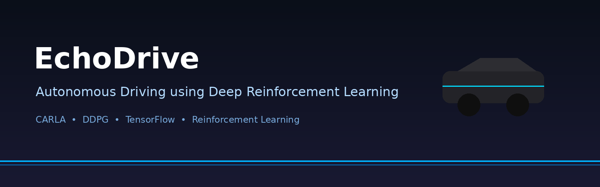
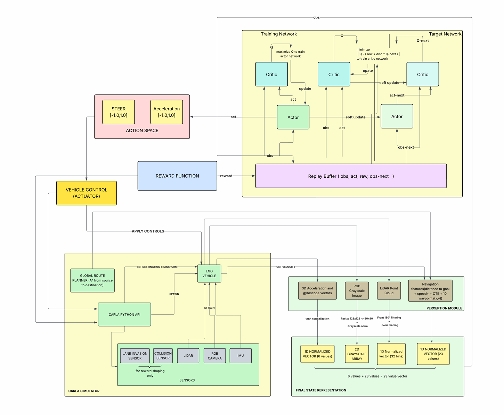
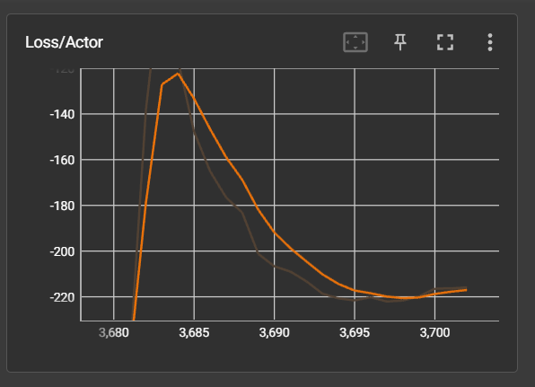
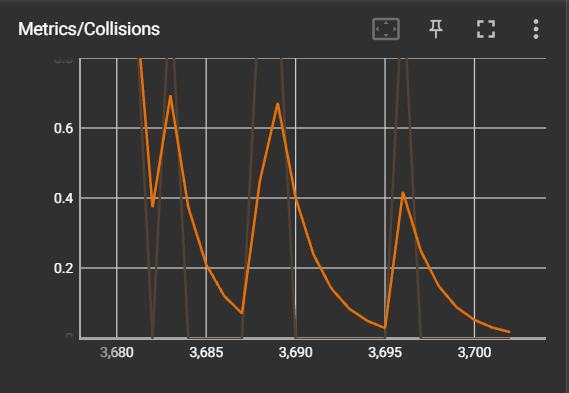

# EchoDrive – Autonomous Driving using Deep Reinforcement Learning

<p align="center">
  
</p>

<p align="center">
  
  
  
  
</p>

---

# Overview

EchoDrive is a Deep Reinforcement Learning based autonomous driving system built using the CARLA Simulator and the Deep Deterministic Policy Gradient (DDPG) algorithm.

The project focuses on training an autonomous vehicle capable of:

- Lane following
- Obstacle avoidance
- Continuous steering and throttle control
- Navigation in dynamic environments
- Generalization to unseen driving scenarios

Unlike DQN-based approaches that rely on discrete actions, EchoDrive uses DDPG to operate in a continuous action space, making it more suitable for realistic autonomous vehicle control.

---

# Demo

## Autonomous Driving in CARLA

<p align="center">
  
</p>

---

# Key Features

- End-to-end autonomous driving in CARLA
- Deep Reinforcement Learning using DDPG
- Multi-modal sensor fusion
- Continuous action control
- Dynamic traffic simulation
- Randomized weather environments
- A* route planning
- Lane invasion monitoring
- Collision handling system
- Zero-shot evaluation in unseen towns

---

# System Architecture

<p align="center">
  
</p>

## Pipeline

1. CARLA environment generates simulation state
2. Sensors collect environmental data
3. State vector is constructed
4. Actor network predicts actions
5. Vehicle executes steering/throttle
6. Critic network evaluates action quality
7. Replay buffer stores transitions
8. Networks update using DDPG

---

# Tech Stack

| Component | Technology |
|---|---|
| Simulator | CARLA |
| RL Algorithm | DDPG |
| Deep Learning | TensorFlow |
| Language | Python |
| Visualization | Matplotlib |
| Route Planning | A* Planner |
| Environment | Unreal Engine |

---

# State Representation

The agent uses a multi-modal observation space:

```text
State =
{
    Grayscale Image Tensor (80 × 80 × 1)
    LiDAR Polar Vector (32)
    Navigation + IMU Vector (29)
}
```

This allows the model to jointly reason about:
- Vision
- Obstacles
- Vehicle dynamics
- Route planning

---

# Sensor Pipeline

## RGB Camera

- Resolution: `128 × 128`
- Grayscale conversion
- Resized to `80 × 80`
- Normalized to `[0,1]`

<p align="center">
  
</p>

---

## LiDAR

- Front 180° obstacle scanning
- Encoded into 32 angular sectors
- Nearest obstacle distance extraction

<p align="center">
  
</p>

---

## IMU + Navigation Features

Includes:
- Speed
- Gyroscope data
- Distance to destination
- Cross-track error
- Future waypoint vectors

---

# Reinforcement Learning Architecture

## Actor Network

### Inputs
- Camera tensor
- LiDAR vector
- Navigation features

### Outputs
- Steering
- Acceleration

---

## Critic Network

### Inputs
- State
- Action

### Output
- Q-value estimation

---

# Reward Function

The reward function encourages:

- Lane discipline
- Goal progression
- Smooth steering
- Collision avoidance
- Stable driving behavior

Penalties are applied for:

- Collisions
- Lane invasions
- Excessive steering oscillations

---

# Installation

## Clone Repository

```bash
git clone https://github.com/Albatrozx11/CARLA-Self-Driving-DDPG.git
cd CARLA-Self-Driving-DDPG
```

---

## Create Virtual Environment

### Windows

```bash
python -m venv venv
venv\Scripts\activate
```

### Linux / macOS

```bash
python3 -m venv venv
source venv/bin/activate
```

---

## Install Dependencies

```bash
pip install -r requirements.txt
```

---

# Installing CARLA

Download CARLA 0.9.x:

- https://carla.org/
- https://github.com/carla-simulator/carla/releases

---

# Running the Project

## Step 1 — Start CARLA

### Windows

```bash
CarlaUE4.exe
```

### Linux

```bash
./CarlaUE4.sh
```

---

## Step 2 — Train Agent

```bash
python train.py
```

Training includes:
- Traffic generation
- Pedestrian spawning
- Sensor attachment
- Replay buffer updates
- Actor-Critic optimization

---

## Step 3 — Evaluate Model

```bash
python evaluate.py
```

Evaluation is performed under:
- Random weather
- Dynamic traffic
- Unseen CARLA towns

---

# Project Structure

```text
CARLA-Self-Driving-DDPG/
│
├── train.py
├── evaluate.py
├── env/
├── models/
├── sensors/
├── utils/
├── logs/
├── checkpoints/
├── assets/
└── README.md
```

---

# Training Performance

## Reward Curve

<p align="center">
  
</p>

The reward trend demonstrates stable convergence and progressive learning over training episodes.

---

## Collision Reduction

<p align="center">
  
</p>

Collision frequency consistently decreased as training progressed.

---

## Lane Invasion Reduction

<p align="center">
  
</p>

The agent learned stable lane-following behavior with reduced lane deviations.

---

# Results

## Quantitative Results

| Metric | Result |
|---|---|
| Training Episodes | 500+ |
| Collision Reduction | 35% |
| Tested Towns | 3+ |
| Action Space | Continuous |
| Sensors Used | RGB + LiDAR + IMU |
| RL Algorithm | DDPG |

---

## Generalization Testing

The trained model was evaluated in:
- Unseen CARLA towns
- Dynamic traffic environments
- Randomized weather conditions

The agent successfully demonstrated:
- Robust lane following
- Smooth steering
- Adaptive obstacle avoidance
- Zero-shot generalization

---

# Research Contributions

This project demonstrates:

- End-to-end autonomous driving using DDPG
- Multi-modal sensor fusion in CARLA
- Continuous control for autonomous navigation
- Robust RL training under randomized environments
- Zero-shot testing on unseen maps

---

# Future Improvements

Planned future work includes:

- TD3 implementation
- TCAMD architecture integration
- Multi-agent reinforcement learning
- Transformer-based perception
- Sim-to-real transfer learning
- Attention mechanisms

---

# References

1. CARLA Simulator  
   https://carla.org/

2. Lillicrap et al. — Deep Deterministic Policy Gradient (DDPG)

3. TensorFlow Documentation  
   https://www.tensorflow.org/

4. Research papers on RL for Autonomous Driving

---

# Citation

```bibtex
@project{echodrive2026,
  title={EchoDrive: Autonomous Driving using Deep Reinforcement Learning},
  author={Adithyan A and Ann Mariyam Prakash and Karthik Manoj and Sachin Umendran},
  year={2026},
  institution={Model Engineering College}
}
```

---

# Team

- Adithyan A
- Ann Mariyam Prakash
- Karthik Manoj
- Sachin Umendran

Guide:
- Ms. Aysha Fymin Majeed

Department of Computer Science Engineering  
Model Engineering College, Kochi

---

# Acknowledgements

- CARLA Simulator Team
- TensorFlow
- Unreal Engine
- OpenDRIVE
- Research papers referenced during implementation
