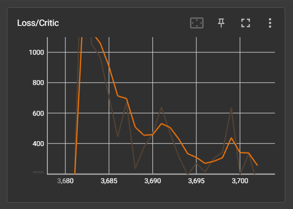

# EchoDrive – Autonomous Driving using Deep Reinforcement Learning

<p align="center">
  
</p>

<p align="center">
  
  
  
  
</p>

---

# Overview

EchoDrive is an autonomous driving system built using Deep Reinforcement Learning in the CARLA Simulator.  
The project uses the Deep Deterministic Policy Gradient (DDPG) algorithm to train an autonomous vehicle capable of continuous steering and throttle control in dynamic driving environments.

The system performs:

- Lane following
- Obstacle avoidance
- Continuous vehicle control
- Navigation in dynamic traffic
- Zero-shot generalization to unseen environments

Unlike DQN-based approaches with discrete actions, DDPG enables smooth continuous control, making it more suitable for autonomous driving tasks.

---

# Simulation Demo

<p align="center">
  
</p>

---

# Features

- End-to-end autonomous driving in CARLA
- Deep Reinforcement Learning using DDPG
- Continuous steering and acceleration control
- Dynamic traffic simulation
- Randomized weather environments
- Multi-modal sensor fusion
- A* route planning
- Replay buffer training
- Collision and lane invasion monitoring
- Zero-shot evaluation in unseen towns

---

# System Architecture

<p align="center">
  
</p>

## Pipeline

1. CARLA generates simulation state
2. Sensors capture environment data
3. State representation is constructed
4. Actor network predicts actions
5. Vehicle executes steering/throttle
6. Critic network evaluates action quality
7. Replay buffer stores experiences
8. Networks update using DDPG

---

# Tech Stack

| Component | Technology |
|---|---|
| Simulator | CARLA |
| RL Algorithm | DDPG |
| Deep Learning | TensorFlow |
| Language | Python |
| Visualization | Matplotlib |
| Route Planning | A* Planner |
| Environment | Unreal Engine |

---

# State Representation

The agent uses a multi-modal observation space:

```text
State =
{
    Grayscale Image Tensor (80 × 80 × 1)
    LiDAR Polar Vector (32)
    Navigation + IMU Vector (29)
}
```

This allows the model to jointly reason about:
- Visual understanding
- Obstacle detection
- Vehicle dynamics
- Route planning

---

# Reinforcement Learning Architecture

## Actor Network

### Inputs
- Camera tensor
- LiDAR vector
- Navigation features

### Outputs
- Steering
- Acceleration

---

## Critic Network

### Inputs
- State
- Action

### Output
- Q-value estimation

---

# Reward Function

The reward function encourages:

- Lane discipline
- Goal progression
- Smooth steering
- Collision avoidance
- Stable driving behavior

Penalties are applied for:
- Collisions
- Lane invasions
- Steering oscillations

---

# Installation

## Clone Repository

```bash
git clone https://github.com/Albatrozx11/CARLA-Self-Driving-DDPG.git
cd CARLA-Self-Driving-DDPG
```

---

## Create Virtual Environment

### Windows

```bash
python -m venv venv
venv\Scripts\activate
```

### Linux / macOS

```bash
python3 -m venv venv
source venv/bin/activate
```

---

## Install Dependencies

```bash
pip install -r requirements.txt
```

---

# Installing CARLA

Download CARLA 0.9.x from:

- https://carla.org/
- https://github.com/carla-simulator/carla/releases

---

# Running the Project

## Step 1 — Start CARLA

### Windows

```bash
CarlaUE4.exe
```

### Linux

```bash
./CarlaUE4.sh
```

---

## Step 2 — Train Agent

```bash
python train.py
```

Training includes:
- Traffic generation
- Pedestrian spawning
- Sensor attachment
- Replay buffer updates
- Actor-Critic optimization

---

## Step 3 — Evaluate Model

```bash
python evaluate.py
```

Evaluation is performed under:
- Random weather
- Dynamic traffic
- Unseen CARLA towns

---

# Project Structure

```text
CARLA-Self-Driving-DDPG/
│
├── train.py
├── evaluate.py
├── env/
├── models/
├── sensors/
├── utils/
├── logs/
├── checkpoints/
├── assets/
└── README.md
```

---

# Training Results

## Total Reward Curve

<p align="center">
  
</p>

The reward trend demonstrates stable convergence and progressive policy learning over training episodes.

---

## Collision Reduction

<p align="center">
  
</p>

Collision frequency consistently decreased as the agent learned safer driving policies.

---

## Actor Loss

<p align="center">
  
</p>

The Actor network gradually learned stable continuous action prediction for steering and throttle control.

---

## Critic Loss

<p align="center">
  
</p>

Critic loss stabilized during training, indicating improved Q-value estimation and policy stability.

---

# Quantitative Results

| Metric | Result |
|---|---|
| Training Episodes | 500+ |
| Collision Reduction | 35% |
| Tested Towns | 3+ |
| Action Space | Continuous |
| Sensors Used | RGB + LiDAR + IMU |
| RL Algorithm | DDPG |

---

# Generalization Testing

The trained model was evaluated in:
- Unseen CARLA towns
- Randomized weather conditions
- Dynamic traffic environments

The agent successfully demonstrated:
- Robust lane following
- Smooth steering control
- Adaptive obstacle avoidance
- Zero-shot generalization

---

# Research Contributions

This project demonstrates:

- End-to-end autonomous driving using DDPG
- Multi-modal sensor fusion in CARLA
- Continuous control for autonomous navigation
- Robust RL training under randomized environments
- Zero-shot testing on unseen maps

---

# Future Improvements

Planned future work includes:

- TD3 implementation
- TCAMD architecture integration
- Multi-agent reinforcement learning
- Transformer-based perception
- Sim-to-real transfer learning
- Attention mechanisms

---

# References

1. CARLA Simulator  
   https://carla.org/

2. Lillicrap et al. — Deep Deterministic Policy Gradient (DDPG)

3. TensorFlow Documentation  
   https://www.tensorflow.org/

4. Research papers on Reinforcement Learning for Autonomous Driving

---

# Citation

```bibtex
@project{echodrive2026,
  title={EchoDrive: Autonomous Driving using Deep Reinforcement Learning},
  author={Adithyan A and Ann Mariyam Prakash and Karthik Manoj and Sachin Umendran},
  year={2026},
  institution={Model Engineering College}
}
```

---

# Team

- Adithyan A
- Ann Mariyam Prakash
- Karthik Manoj
- Sachin Umendran

Guide:
- Ms. Aysha Fymin Majeed

Department of Computer Science Engineering  
Model Engineering College, Kochi

---

# Acknowledgements

- CARLA Simulator Team
- TensorFlow
- Unreal Engine
- OpenDRIVE
- Research papers referenced during implementation
